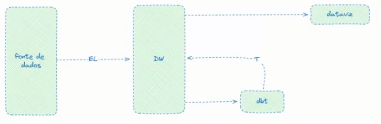
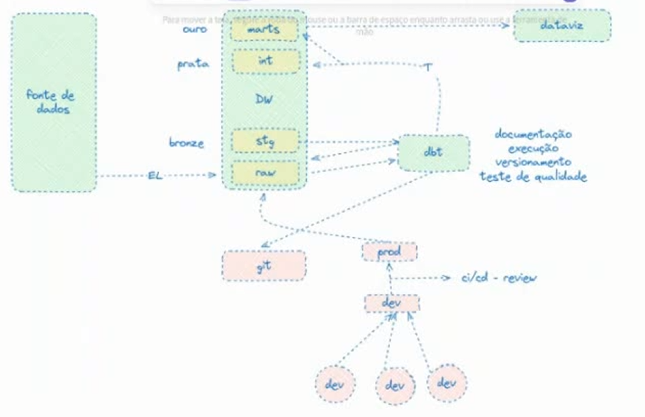

# DBT Learn

## Visão Geral

### O que é DBT?
O **DBT (Data Build Tool)** é uma ferramenta de transformação de dados que permite modularizar e centralizar código analítico, garantindo maior qualidade e eficiência no fluxo de dados.

**Utilizado para:**

- **Modularização e centralização do código**: Facilita a organização e reutilização de código para análises.
- **Engenharia de software para dados**: Introduz boas práticas de desenvolvimento, como versionamento e testes automatizados.
- **Colaboração em modelos de dados**: Permite que equipes de dados trabalhem juntas de forma eficiente.
- **Versionamento, testes e documentação**: Garante rastreabilidade, qualidade e padronização dos modelos de dados.
- **Monitoramento e visibilidade**: Possibilita auditoria e controle sobre transformações e pipelines de dados.

## Tópicos

### 1. Configuração do DBT
- Instalação e configuração inicial
- Conexão com bancos de dados
- Estrutura de diretórios do DBT

### 2. Construindo projetos com DBT
- Criação de modelos (`.sql` e `.yml`)
- Utilização do `dbt run` e `dbt test`
- Implementação de macros e seeds

### 3. Implantação do DBT
- Melhores práticas para deploy
- Automação de pipelines com DBT Cloud e CI/CD

### 4. Trabalhando em equipe com DBT
- Uso de versionamento com Git
- Revisão e controle de mudanças
- Padrões para colaboração eficiente

### 5. Boas práticas em dados com DBT
- Modelagem de dados eficiente
- Uso de documentação e testes
- Monitoramento e otimização de desempenho

---

### DBT

### Cloud
Oferece uma maneira confiável e escalável de implementar o DBT. Permitindo que equipes de dados otimizem suas transformações, desenvolvendo, testando, agendando e investigando modelos de ados utilizando um único serviço gerenciado por meio de uma UI baseado na web

### Core

Ferramenta de código aberto que permite profissionais transformarem dados.
É adequada para usuários que preferem configurar o DBT manualmente e mantê-lo localmente

#### Vantagens

- Evite escrever DML e DDL gerenciando transações, descartando tabelas e alterações de esquemas
- Escreva lógica de negócios apenas com SQL ou Python
- Crie modelos de dados reutilizáveis ou modulares que possam ser referenciados em projetos futuros
- Reduz drasticamente o tempo de execução das consultas aproveitando metadados. 
- Integre o DBT no seu ecossistema
- Ampla orquestração
- Conexão com os principais tipos de banco de dados

### Arquitetura recomendada para equipes

DBT é uma ferramenta poderosa e com a arquitetura correta vai com certeza mudar o jeito como os dados são tratados na sua companhia

